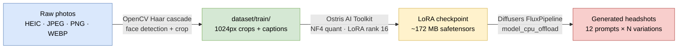
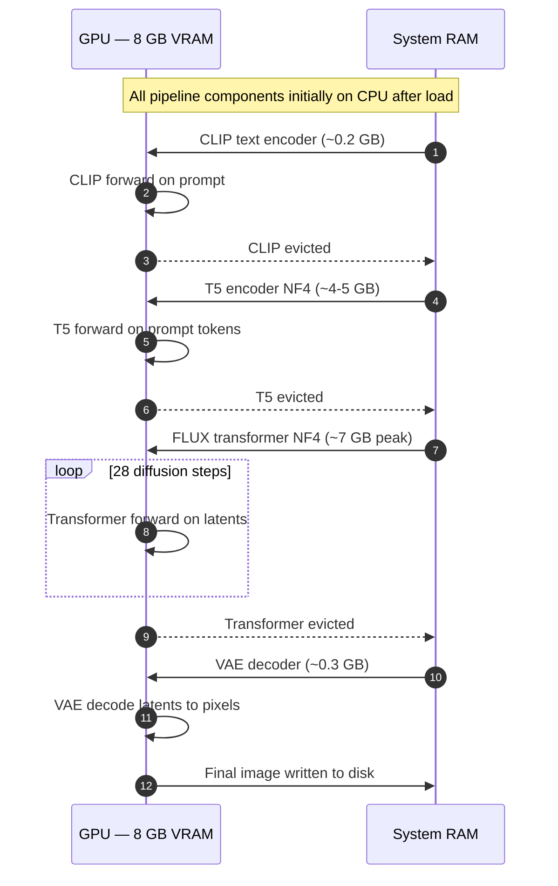
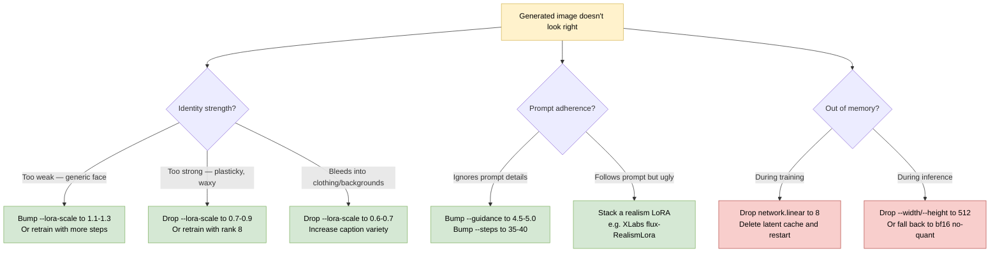

# flux-headshot-lora

> Train a personal **FLUX.1-dev LoRA** on your own photos and generate professional headshots locally. Tuned for 8 GB VRAM laptops, scales up to 24 GB+ desktops. Three commands from raw photos to LinkedIn-ready output.

```powershell
python scripts\prep_dataset.py                                   # 1. prep
python run.py ..\flux-headshot-lora\config\headshot_lora.yaml    # 2. train (from ai-toolkit\)
python scripts\generate_headshots.py --lora <path> --count 3     # 3. generate
```

---

## What it does

You drop 15–25 photos of yourself into `dataset/raw/`. The pipeline crops them to head+shoulders, fine-tunes a FLUX LoRA adapter on your face, and then batch-generates studio headshots from a library of 12 styled prompts.



| Stage | Time on 8 GB laptop | Time on 24 GB desktop |
| --- | --- | --- |
| **Prep** | ~10 seconds | ~10 seconds |
| **Train** (1000 steps) | ~10 hours | ~30 minutes |
| **Generate** (36 images) | ~2 hours | ~8 minutes |

Training is the time sink. Set the machine to never sleep and walk away... there's no auto-resume from interruption. Also, make sure you have good cooling- i placed my laptop on it's side for good airflow.

---

## Hardware tiers

| Tier | Example GPUs | VRAM | Training config | Inference |
| --- | --- | --- | --- | --- |
| **Borderline** | RTX 5070 Laptop, 4060 Ti 8 GB | **8 GB** | NF4 quant, rank 16, res 512, EMA off | `model_cpu_offload` at 768×1024 |
| **Comfortable** | RTX 4070, 3080 12 GB | **12 GB** | NF4 quant, rank 32, res [512,768,1024] | `model_cpu_offload` at 896×1152 |
| **Spacious** | RTX 4090, 5080, 5090 | **16–32 GB** | bf16 (no quant), rank 64, batch 2 | No offload, fp16 direct |

Defaults in this repo target the **8 GB borderline tier**. Scale up via [Tuning](#tuning).

---

## Prerequisites

- **OS** Windows 11 (tested) or Linux (should work, untested).
- **Python 3.11 or 3.12.** *Do not use 3.13 or 3.14* AI Toolkit pins `scipy==1.12.0`, which has no wheel past cp312, and a from-source build demands a Fortran compiler (ifort/gfortran/flang) you almost certainly don't have.
- **NVIDIA GPU**, Compute Capability ≥ sm_75 (Turing or newer). Blackwell (sm_120) verified on RTX 5070 Laptop.
- **~60 GB free disk** for FLUX.1-dev weights, HF cache, and training latent cache.
- **16 GB system RAM** minimum. 32 GB recommended if you ever want to try non-quantized inference.
- **Hugging Face account** with the license accepted for [`black-forest-labs/FLUX.1-dev`](https://huggingface.co/black-forest-labs/FLUX.1-dev). It's gated click through the form before you try to download.

---

## Setup

This repo is designed to be cloned **as a sibling** of Ostris AI Toolkit. The config paths assume this layout:

```
parent-dir\
├── ai-toolkit\           (upstream training framework)
└── flux-headshot-lora\   (this repo)
```

```powershell
# 1. Clone both repos side-by-side
cd C:\Dev   # or wherever you keep projects
git clone https://github.com/ostris/ai-toolkit.git
git clone https://github.com/<your-user>/flux-headshot-lora.git

# 2. Create a Python 3.12 venv inside flux-headshot-lora
#    (use `py -0` to list installed Pythons;
#     `winget install Python.Python.3.12` if missing)
cd flux-headshot-lora
py -3.12 -m venv .venv
.venv\Scripts\Activate.ps1
python --version    # sanity check — should say 3.12.x

# 3. Install PyTorch with Blackwell (cu128) support FIRST.
#    torch, torchvision, and torchaudio must all come from the
#    cu128 index PyPI's default ships a CPU-only torchvision.
pip install torch torchvision torchaudio --index-url https://download.pytorch.org/whl/cu128

# 4. Install this project's Python deps
pip install -r requirements.txt

# 5. Install AI Toolkit's Python deps into the SAME venv.
#    This pulls in dotenv, oyaml, scipy 1.12 (cp312 wheel), etc.
pip install -r ..\ai-toolkit\requirements.txt

# 6. Authenticate with Hugging Face.
#    Use the OLD `huggingface-cli` binary, not `hf` — AI Toolkit
#    downgrades huggingface_hub to <1.0 where the new `hf` CLI
#    doesn't exist yet.
huggingface-cli login

# 7. Smoke test (~2 min after HF cache warms).
#    Downloads FLUX.1-dev on first run (~24 GB) and runs a single
#    generation without any LoRA. Confirms torch cu128, bitsandbytes
#    NF4 on your Blackwell/Ampere/Ada GPU, and diffusers + FluxPipeline
#    all wire up correctly before you commit to a 10-hour training run.
python scripts\smoke_test.py
```

> **Linux / macOS notes:** swap backslashes for forward slashes; use `python3.12 -m venv .venv` and `source .venv/bin/activate`. macOS has no cu128 wheel — you'd need a different optimization story entirely (CoreML or CPU).

---

## Workflow

### 1. Drop photos into `dataset/raw/`

15–25 photos. **Variety matters more than count.**

| Do | Don't |
| --- | --- |
| 3/4, straight-on, slight profile angles | Sunglasses or heavy filters |
| Indoor, outdoor, window light, golden hour | Group photos, or faces smaller than ~20% of frame |
| Neutral, smile, serious expressions | Extreme angles where most of the face is hidden |
| Different backgrounds | Same shirt + same pose in every photo |
| HEIC/HEIF from iPhone (supported) | Screenshots or heavily-compressed JPEGs |

### 2. Prep the dataset

```powershell
python scripts\prep_dataset.py
```

Under the hood:

- Reads JPEG, PNG, WEBP, HEIC, HEIF (iPhone photos work directly — pillow-heif is registered at import).
- Respects EXIF orientation so phone photos don't end up sideways.
- Runs OpenCV Haar cascade face detection; expands the face bbox to a head+shoulders frame (face height × 3.2, shifted down 0.4× for shoulder inclusion).
- Falls back to a center crop when detection misses.
- Resizes to 1024 px on the longest side.
- Writes `NNN_<source>.jpg` + matching `NNN_<source>.txt` caption (`a photo of ohwx_person`) to `dataset/train/`.

Output summary looks like `Prepped 26 image(s) → ... (face detected on 22/26)`. If detection rate drops below 70 %, investigate which photos failed they'll still be in the training set via center crop, but with worse framing.

**Override the trigger:** `--trigger your_token` (must match `trigger_word` in `config/headshot_lora.yaml` if you plan to edit the YAML).

### 3. Train the LoRA

```powershell
cd ..\ai-toolkit
python run.py ..\flux-headshot-lora\config\headshot_lora.yaml
```

What happens:

1. First run downloads FLUX.1-dev (~24 GB) into the Hugging Face cache.
2. Transformer and T5 text encoder are quantized to **NF4** via bitsandbytes.
3. Training latents are cached to disk once (~30 s).
4. A LoRA network is attached (rank 16 by default on 8 GB; 494 trainable U-Net modules).
5. **1000 training steps** run with AdamW8bit, gradient checkpointing, and EMA disabled.
6. Checkpoints land in `..\flux-headshot-lora\output\loras\my_headshot_lora\` every 250 steps.

Final file: `output\loras\my_headshot_lora\my_headshot_lora.safetensors`.

### 4. Generate headshots

```powershell
cd ..\flux-headshot-lora
python scripts\generate_headshots.py --lora output\loras\my_headshot_lora\my_headshot_lora.safetensors --count 3
```

- Loops through the 12 prompts in `scripts\prompts.py` × `--count` variations = 36 images by default.
- Each run is saved to a timestamped subdirectory under `output\images\`.
- Filenames encode the prompt index, a slugified prompt excerpt, and the seed, e.g. `03_friendly_linkedin_headshot_s3042.png`.

---

## How inference fits into 8 GB

**Model-level CPU offload** is the linchpin. Here's the phase-by-phase memory choreography during a single generation:



**Key invariant:** only one major component is ever resident on GPU at a time. Peak VRAM is the transformer at ~7 GB of NF4 weights + ~0.7 GB of activations at 768×1024 = right at the 8 GB limit.

**Why not `enable_sequential_cpu_offload` instead?** It splits each component into per-layer chunks and shuffles them during the forward pass. That triggers a long-standing bitsandbytes bug where `Params4bit.to(device)` raises `NotImplementedError: Cannot copy out of meta tensor; no data!` when the QuantState has been routed through accelerate's per-layer hook system. `enable_model_cpu_offload` swaps whole sub-models in one shot, which avoids the per-layer code path entirely.

---

## Tuning

### 8 GB (repo defaults)

```yaml
network:
  linear: 16
datasets:
  - resolution: [512]
train:
  ema_config:
    use_ema: false
  skip_first_sample: true
  disable_sampling: true
model:
  quantize: true
  low_vram: true
```

Inference script uses `enable_model_cpu_offload()` and defaults to 768×1024.

### 12 GB (RTX 4070 / 3080)

```yaml
network:
  linear: 32
  linear_alpha: 32
datasets:
  - resolution: [512, 768, 1024]
train:
  ema_config:
    use_ema: true
    ema_decay: 0.99
  # sampling can run; remove skip_first_sample / disable_sampling
```

Inference script can stay on `enable_model_cpu_offload()` but bump default to 896×1152.

### 24 GB (RTX 4090 / 5090)

```yaml
network:
  linear: 64
  linear_alpha: 64
datasets:
  - resolution: [512, 768, 1024]
train:
  batch_size: 2
model:
  quantize: false   # full bf16 — sharper training signal
```

Inference script: drop the offload calls entirely, load everything in bf16, run at 1024×1280 or 1280×1536.

### When the output looks wrong



---

## Repo layout

```
flux-headshot-lora/
├── config/
│   └── headshot_lora.yaml      # AI Toolkit training config (8 GB tuned)
├── scripts/
│   ├── prep_dataset.py         # Haar cascade face crop + captioning
│   ├── smoke_test.py           # 4-phase env/install check before training
│   ├── generate_headshots.py   # NF4 FLUX + model offload + LoRA + batch
│   └── prompts.py              # 12 headshot prompt templates
├── dataset/
│   ├── raw/                    # drop your photos here (gitignored)
│   └── train/                  # prep_dataset.py output (gitignored)
├── output/
│   ├── loras/                  # trained LoRAs (gitignored)
│   └── images/                 # generated headshots (gitignored)
├── requirements.txt            # Python deps (torch installed separately)
└── README.md
```

---

## Troubleshooting

Real issues hit during development, with the exact fix for each.

| Symptom | Root cause | Fix |
| --- | --- | --- |
| `scipy` build fails demanding `ifort` / `gfortran` | Venv is Python 3.13 or 3.14; scipy 1.12.0 has no wheel past cp312 | Rebuild venv with `py -3.12 -m venv .venv` |
| `ModuleNotFoundError: No module named 'dotenv'` in AI Toolkit | AI Toolkit's own deps aren't in your venv | `pip install -r ..\ai-toolkit\requirements.txt` |
| `ModuleNotFoundError: No module named 'torchaudio'` | AI Toolkit imports torchaudio but doesn't pin it; torch cu128 wheel doesn't bundle it | `pip install torchaudio --index-url https://download.pytorch.org/whl/cu128` |
| `torchvision 0.26.0+cpu` installed (no GPU ops) | pip resolver pulled the PyPI CPU wheel during AI Toolkit install | `pip uninstall torchvision && pip install torchvision --index-url https://download.pytorch.org/whl/cu128` |
| `AttributeError: module 'mediapipe' has no attribute 'solutions'` | Some MediaPipe wheels dropped the legacy `mp.solutions` namespace | This repo uses OpenCV Haar cascades instead — no MediaPipe dependency |
| `ValueError: text input must be of type str` during training baseline sample | AI Toolkit's `encode_prompts_flux` vs transformers 4.57+ tokenizer signature | Set `train.skip_first_sample: true` and `train.disable_sampling: true` in the YAML |
| `NotImplementedError: Cannot copy out of meta tensor` when **loading LoRA** into a quantized pipeline | Sequential offload hook detach clashes with NF4 QuantState | Load the LoRA *before* enabling any offload |
| Same error during **T5 forward pass** at generation time | `enable_sequential_cpu_offload` shuffles sub-modules per layer, hits the NF4 `.to()` bug mid-forward | Use `enable_model_cpu_offload` — coarser whole-model swaps |
| `hf: command not found` after installing AI Toolkit | AI Toolkit downgraded `huggingface_hub` below 1.0 | Use the old binary `huggingface-cli login` |
| PowerShell rejects bash-style `\` line continuations | PowerShell uses backtick `` ` `` | Put the command on one line, or swap `\` for `` ` `` |

---

## Credits

- **[Ostris AI Toolkit](https://github.com/ostris/ai-toolkit)** — the training framework that does all the heavy lifting. This repo is a config + scripts + docs layer on top.
- **[Black Forest Labs · FLUX.1-dev](https://huggingface.co/black-forest-labs/FLUX.1-dev)** — the base diffusion model.
- **[Diffusers](https://github.com/huggingface/diffusers)** — the inference pipeline.
- **[bitsandbytes](https://github.com/bitsandbytes-foundation/bitsandbytes)** — the NF4 quantization that makes FLUX training and inference fit in ≤12 GB.
- **[pillow-heif](https://github.com/bigcat88/pillow_heif)** — iPhone HEIC decoding.

---

## License

